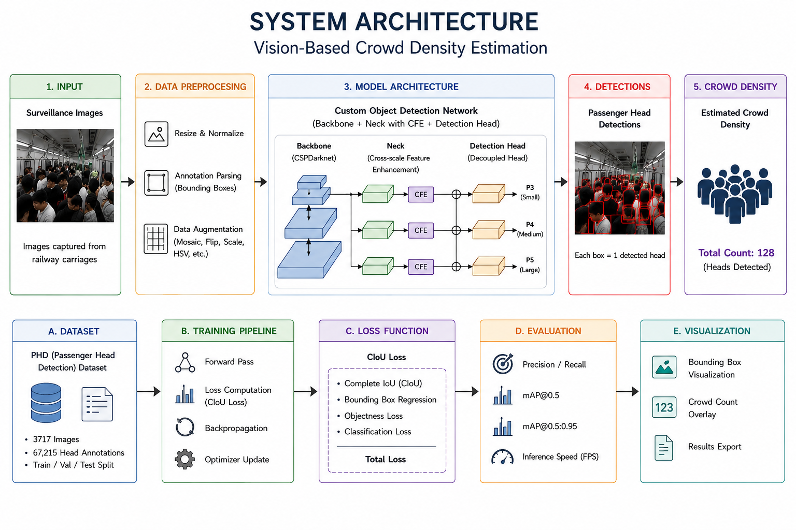
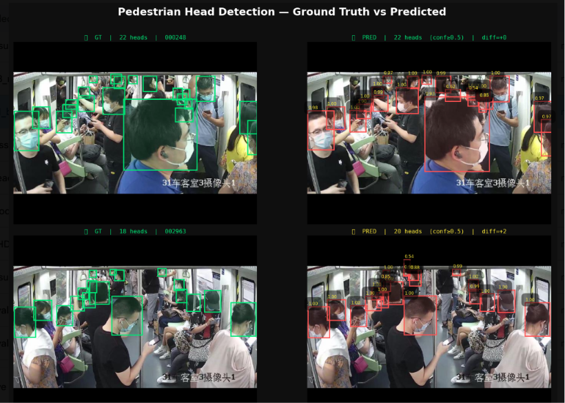

# Vision-Based Crowd Density Estimation

<p align="center">
A deep learning framework for estimating passenger crowd density from surveillance images using a custom object detection pipeline implemented in PyTorch.
</p>

---

## Overview

Vision-based crowd density estimation plays a crucial role in intelligent transportation systems by enabling automatic monitoring of passenger congestion using surveillance cameras. Accurate crowd estimation improves passenger safety, traffic management, and operational efficiency without requiring additional hardware sensors.

This project presents a complete deep learning pipeline for passenger head detection and crowd density estimation from surveillance images. The system is implemented entirely in **PyTorch**, including dataset preprocessing, model architecture, loss computation, training, evaluation, and visualization modules.

---

## Problem Statement

Estimating crowd density in densely populated environments is challenging due to:

- Heavy occlusion among passengers
- Large variation in object scales
- Small object detection
- Overlapping heads
- Real-time processing requirements

Instead of relying on manual monitoring or expensive sensor-based systems, this project estimates crowd density by detecting passenger heads from surveillance images captured inside railway carriages.

---

## Key Features

- Deep learning-based passenger head detection
- Vision-based crowd density estimation
- Custom PyTorch implementation
- Dataset preprocessing pipeline
- Modular model architecture
- Training and evaluation pipeline
- Custom loss implementation
- Visualization of prediction results
- Google Colab support

---

# System Architecture

<p align="center">



</p>

---

# Results

### Ground Truth vs Model Prediction

<p align="center">



</p>

### Evaluation Metrics

| Metric | Score |
|---------|-------|
| Precision | 0.8155 |
| Recall | 0.9651 |
| F1 Score | 0.8840 |
| mAP@0.5 | 0.9592 |
| mAP@0.5:0.95 | 0.6995 |
| FPS | 78 |

---

## Dataset

This project utilizes the **Passenger Head Detection (PHD) Dataset**, a publicly available benchmark dataset developed for passenger head detection in railway carriage surveillance images.

### Dataset Statistics

- 3717 surveillance images
- 67,215 annotated passenger heads
- Train / Validation / Test split
- Bounding box annotations
- Multiple crowd densities
- Dense passenger scenarios

**Note**

The dataset is **not included** in this repository.

Please download it from the official repository provided by the original authors.

---

## Installation

Clone the repository

```bash
git clone https://github.com/<your-username>/Vision-Based-Crowd-Density-Estimation.git

cd Vision-Based-Crowd-Density-Estimation
```

Install dependencies

```bash
pip install -r requirements.txt
```

---

## Training

Run

```bash
python train.py
```

---

## Evaluation

Run

```bash
python evaluate.py
```

---

## Visualization

Run

```bash
python visualize.py
```

---

## Technologies Used

- Python
- PyTorch
- OpenCV
- NumPy
- Matplotlib
- Google Colab

---

## Future Improvements

- Real-time video inference
- Deployment using ONNX / TensorRT
- Improved performance under severe occlusion
- Multi-camera crowd monitoring
- Lightweight deployment for edge devices

---

## Acknowledgements

This project makes use of the **Passenger Head Detection (PHD) Dataset**, which was generously released by the original authors for academic research.

Their work has significantly contributed to research in vision-based crowd density estimation.

Special thanks to:

> Jiajing Xu, Mingda Zhai, Yuan Tian and Jun Wu

for publicly releasing the dataset and their research.

---

## Reference

Xu, J., Zhai, M., Tian, Y., & Wu, J.

**Vision-based Passenger Head Detection for Carriage Crowd Density Estimation**

Neurocomputing, 2025.

Dataset Repository:

https://github.com/Xujiajing111/PHD

---

## License

This repository contains **my implementation** of a vision-based crowd density estimation framework.

The dataset used in this project is **not included** and remains subject to the original authors' licensing terms.